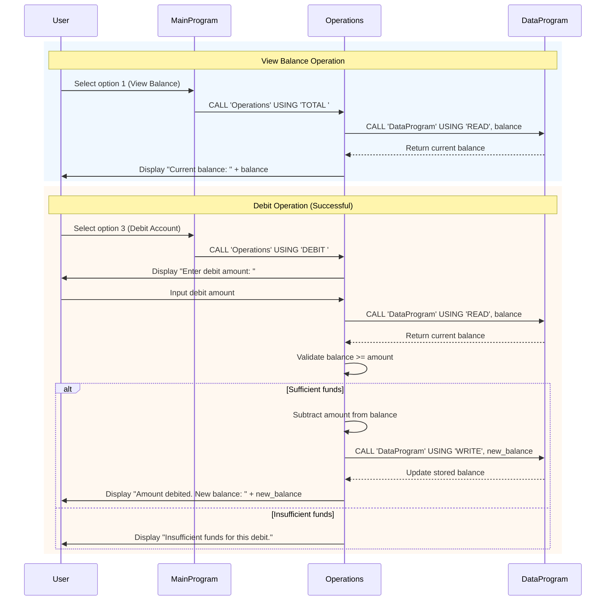

# Modernize your legacy code with GitHub Copilot

Hey abhisheksap-abap1!

Mona here. I'm done preparing your exercise. Hope you enjoy! 💚

Remember, it's self-paced so feel free to take a break! ☕️

---

## Data Flow Sequence Diagram

The following sequence diagram illustrates the data flow for two common operations: viewing the account balance and performing a debit transaction.

&copy; 2025 GitHub &bull; [Code of Conduct](https://www.contributor-covenant.org/version/2/1/code_of_conduct/code_of_conduct.md) &bull; [MIT License](https://gh.io/mit)

