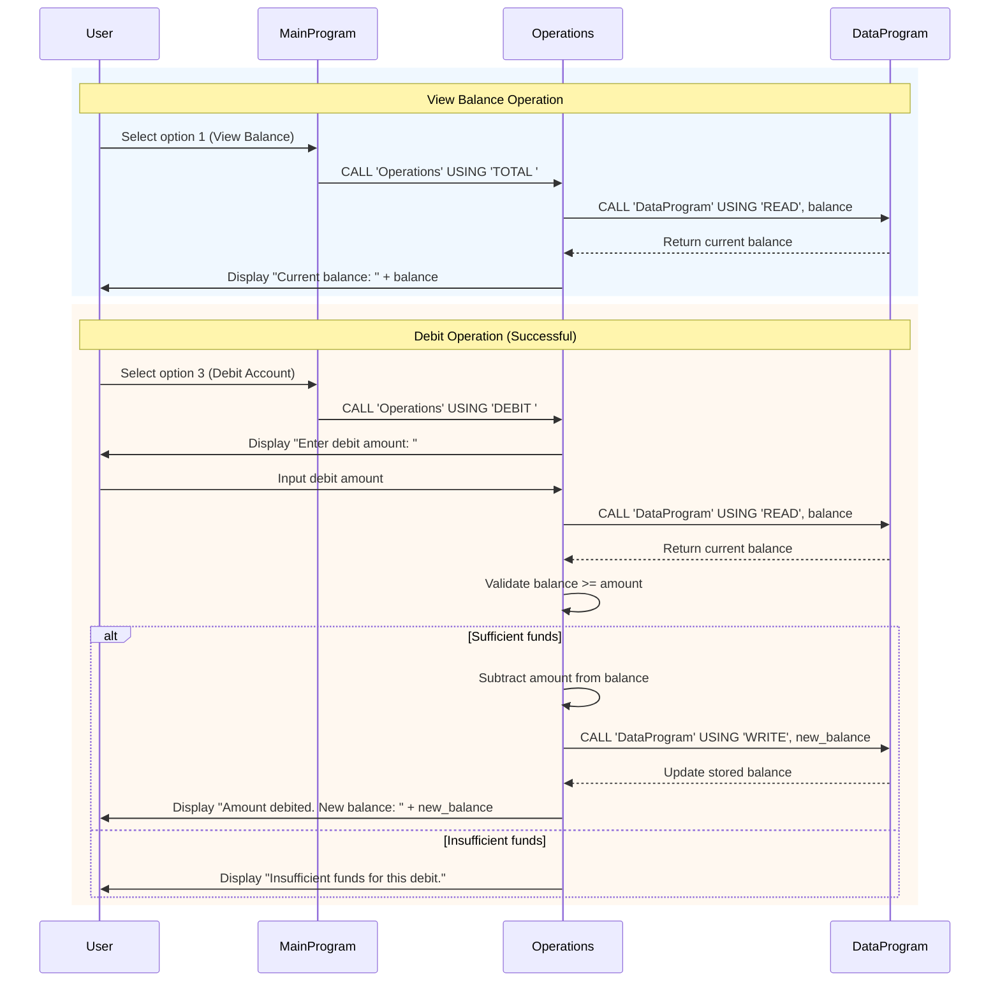

# COBOL Student Account Management System

This project contains a legacy COBOL-based system for managing student accounts. The system allows viewing account balances, crediting accounts, and debiting accounts with basic validation.

## COBOL Files Overview

### data.cob
**Purpose:** Serves as the data storage layer for the account balance.

**Key Functions:**
- Stores the current account balance in working storage (initially set to 1000.00)
- Provides read/write operations for the balance through linkage section parameters
- Handles 'READ' operations to retrieve the current balance
- Handles 'WRITE' operations to update the stored balance

**Business Rules:** None specific; acts as a simple data repository.

### main.cob
**Purpose:** Main entry point and user interface for the account management system.

**Key Functions:**
- Displays a menu-driven interface with options for account operations
- Accepts user input for operation selection
- Calls the Operations program with appropriate operation types
- Manages program flow and exit conditions

**Business Rules:** None specific; provides the user interface layer.

### operations.cob
**Purpose:** Handles the core business logic for account operations.

**Key Functions:**
- Processes different operation types: TOTAL (view balance), CREDIT, DEBIT
- For TOTAL: Retrieves and displays the current balance
- For CREDIT: Accepts an amount, adds it to the balance, and updates storage
- For DEBIT: Accepts an amount, validates sufficient funds, subtracts from balance if valid
- Displays operation results and updated balances

**Business Rules Related to Student Accounts:**
- **Initial Balance:** Student accounts start with a balance of 1000.00
- **Debit Validation:** Debits are only allowed if the account has sufficient funds (balance >= debit amount)
- **Insufficient Funds Handling:** If a debit exceeds the available balance, the transaction is rejected with an "Insufficient funds" message
- **Balance Updates:** All successful transactions (credit/debit) immediately update the stored balance
- **Transaction Feedback:** The system provides immediate feedback on transaction success and updated balance

## System Architecture

The system follows a modular design:
- `main.cob` handles user interaction
- `operations.cob` contains business logic
- `data.cob` manages data persistence

Programs communicate through CALL statements and linkage sections, passing operation types and balance values as needed.

## Data Flow Sequence Diagram

The following sequence diagram illustrates the data flow for two common operations: viewing the account balance and performing a debit transaction.

